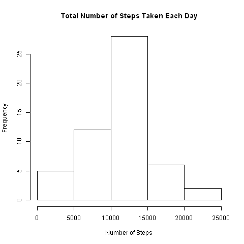
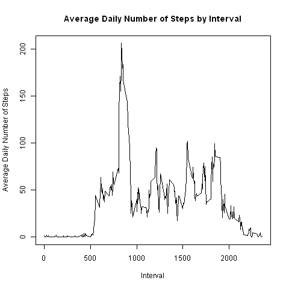
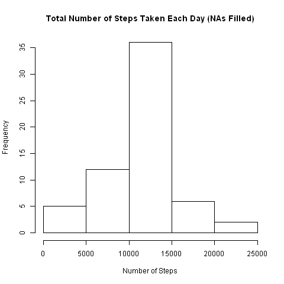
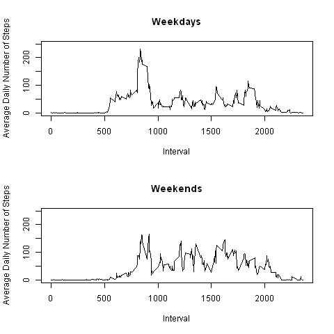

# Reproducible Research: Peer Assessment 1


## Loading and preprocessing the data

I retrieved the data.


```r
fileUrl <- "https://d396qusza40orc.cloudfront.net/repdata%2Fdata%2Factivity.zip"
if(!file.exists("actmon.zip")){
    download.file(fileUrl, destfile = "actmon.zip")
}

unzip("actmon.zip")

actMonData <- read.csv("activity.csv")
```

Convert "date" factor to Date class


```r
actMonData$date <- as.Date(actMonData$date)
```

## What is mean total number of steps taken per day?

Calculate the total number of steps taken per day

```r
dailyStepsByDate <- aggregate(actMonData$steps, by=list(actMonData$date), sum)
```
Cleanup column names

```r
names(dailyStepsByDate) <- c("Date", "Steps")
```

Plot histogram of daily steps

```r
png("HistogramOfTotalStepsEachDay.png")
hist(dailyStepsByDate$Steps, main = "Total Number of Steps Taken Each Day", xlab = "Number of Steps")
dev.off()
```

```
## png 
##   2
```



## What is the average daily activity pattern?

Calculate mean number of steps per day

```r
mean(dailyStepsByDate$Steps,na.rm = TRUE)
```

```
## [1] 10766.19
```
Result is 10766.19

Calculate median number of steps per day

```r
median(dailyStepsByDate$Steps,na.rm = TRUE)
```

```
## [1] 10765
```
Result is 10765

Calculate the mean number of steps taken by interval

```r
dailyStepsByInterval <- tapply(actMonData$steps, actMonData$interval, mean, na.rm = TRUE)
```

Plot time series of average daily steps

```r
png("TimeSeriesOfAverageStepsEachDay.png")
plot(row.names(dailyStepsByInterval), dailyStepsByInterval, type="l", main = "Average Daily Number of Steps by Interval", xlab = "Interval", ylab = "Average Daily Number of Steps")
dev.off()
```

```
## png 
##   2
```



Find interval with maximnum number of steps

```r
maxInterval <- which.max(dailyStepsByInterval)
names(maxInterval[1])
```

```
## [1] "835"
```
Result is 835

## Imputing missing values

Count NAs

```r
sum(is.na(actMonData$steps))
```

```
## [1] 2304
```

Result is 2304

Copy Data

```r
actMonDataFilledNas <- actMonData
```

Replace NAs with average for appropriate interval

```r
for (naRowNumber in which(is.na(actMonDataFilledNas$steps))) {
    
    interval <- actMonDataFilledNas[naRowNumber,]$interval
    replacingValue <- dailyStepsByInterval[toString(interval)]
    actMonDataFilledNas[naRowNumber,]$steps <- replacingValue
}
```

Calculate the total number of steps taken per day

```r
dailyStepsByDateWithNasFilled <- aggregate(actMonDataFilledNas$steps, by=list(actMonDataFilledNas$date), sum)
```

Cleanup column names

```r
names(dailyStepsByDateWithNasFilled) <- c("Date", "Steps")
```

Plot histogram of daily steps

```r
png("HistogramOfTotalStepsEachDayWithNasFilled.png")
hist(dailyStepsByDateWithNasFilled$Steps, main = "Total Number of Steps Taken Each Day (NAs Filled)", xlab = "Number of Steps")
dev.off()
```

```
## png 
##   2
```



Calculate mean number of steps per day

```r
mean(dailyStepsByDateWithNasFilled$Steps,na.rm = TRUE)
```

```
## [1] 10766.19
```

Result is 10766.19, which is the same as prior to "filling in" NAs

Calculate median number of steps per day

```r
median(dailyStepsByDateWithNasFilled$Steps,na.rm = TRUE)
```

```
## [1] 10766.19
```
Result is 10766.19, which is greater than prior to "filling in" NAs

## Are there differences in activity patterns between weekdays and weekends?

Add WeekdayWeekend column

```r
actMonDataFilledNas$WeekdayWeekend <- factor((weekdays(actMonDataFilledNas$date) %in% c("Saturday", "Sunday")), levels = c(FALSE, TRUE), labels=c("Weekday", "Weekend"))
```

Calculate the mean number of steps taken by interval

```r
weekdayData <- actMonDataFilledNas[which(actMonDataFilledNas$WeekdayWeekend == "Weekday"),]
weekendData <- actMonDataFilledNas[which(actMonDataFilledNas$WeekdayWeekend == "Weekend"),]

dailyStepsByIntervalWeekdays <- tapply(weekdayData$steps, weekdayData$interval, mean, na.rm = TRUE)
dailyStepsByIntervalWeekends <- tapply(weekendData$steps, weekendData$interval, mean, na.rm = TRUE)
```

Plot time series to compare weekend/weekdays

```r
png("WeekdayWeekendCompTimeSeries.png")
par(mfrow=c(2,1))
plot(row.names(dailyStepsByIntervalWeekdays), dailyStepsByIntervalWeekdays, type="l", main = "Weekdays", xlab = "Interval", ylab = "Average Daily Number of Steps", ylim= c(0,250))
plot(row.names(dailyStepsByIntervalWeekends), dailyStepsByIntervalWeekends, type="l", main = "Weekends", xlab = "Interval", ylab = "Average Daily Number of Steps", ylim= c(0,250))
dev.off()
```

```
## png 
##   2
```


